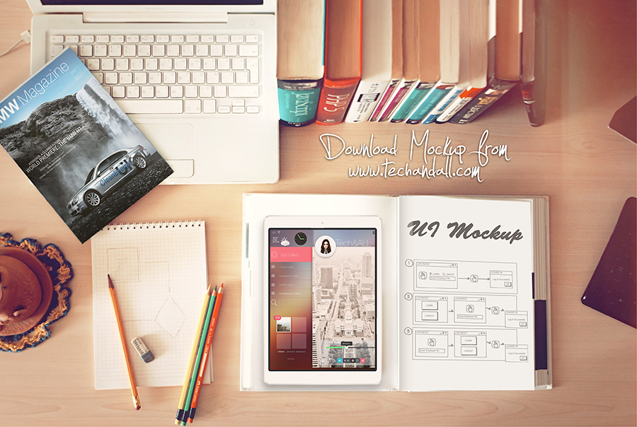
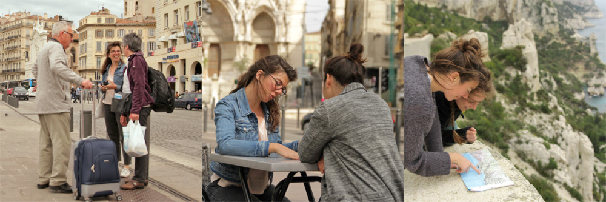

## Une aide précieuse dans l'organisation de vos vacances, avec un programme sur mesure, un accueil personnel et une interlocutrice sur place.

#### Un itinéraire sur mesure : Je vous concocte un itinéraire personnalisé avec une sélection de lieux, événements, restaurants, activités, circuits et visites, selon vos intérêts et votre budget.

===

 

**Je vous suggère un itinéraire sur mesure en fonction de vos goûts et votre budget. Grâce à un contact en amont de votre arrivée, je vous concocte un programme personnalisé pour que vous puissiez profiter au maximum de vos vacances.**

Nous entrons en contact avant votre arrivée. Par téléphone, mail ou Skype, nous ferons connaissance, et selon vos envies, je pars à la recherche d’un itinéraire personnalisé. Je vous suggère un circuit et des activités qui vous correspondent et vous bénéficiez d’un programme sur mesure.

En fonction de vos goûts et votre budget, je vous donne des adresses de restaurants, de lieux et je vous fais part des évènements culturels qui pourraient vous plaire.

Ce service vous permet de sortir des sentiers très touristiques et découvrir facilement les meilleures facettes de Marseille. Grâce à mes suggestions, vous pourrez découvrir “votre” Marseille et gagner du temps dans la préparation de votre séjour pour profiter au maximum de vos vacances.

___

#### Un accueil amical : Un rendez-vous d’une heure pour faire vos premiers pas dans la ville et profiter de mes conseils pour connaître les informations importantes.

**Je vous accueille personnellement à votre arrivée pour vous présenter votre quartier et vous donner les informations importantes sur la ville. Vous profiterez de mes conseils et recevrez la documentation essentielle pour bien débuter votre séjour.**

Lors d’un rendez-vous d’une heure, nous discutons de votre séjour. Grâce à une présentation générale de la ville, vous pourrez connaître toutes les informations utiles : le mode de vie, les quartiers, les évènements, les transports, les horaires…

Nous ferons un point sur les incontournables et vous pourrez poser toutes vos questions.

Votre cahier de route, un plan de la ville, des plaquettes informatives en main, vous aurez le nécessaire pour vous orienter et bien commencer votre séjour.

Cet accueil convivial vous permet de faire vos premiers pas dans la ville en toute simplicité et gagner du temps dans la recherche d’information.

___

#### Un contact au quotidien: Posez vos questions par téléphone (appel, sms, Whatsapp, email) et recevez mes recommandations en direct ! Un service accessible 7j/7.

**Je suis votre interlocuteur au quotidien. Posez vos questions par téléphone (appel, sms, Whatsapp, email) et recevez mes recommandations en direct. Un service accessible 7 jours sur 7 pour vous faciliter la vie. **

Vous savez à qui vous adresser pour toutes vos demandes spontanées. Un bon moyen de connaître les bons plans autour de vous, en temps réel et enrichir votre programme.

Telle une hotline, vous pourrez me contacter au jour le jour pour poser vos questions.

Un conseil pour un bon brunch près de chez vous, une adresse pour acheter une bonne bouteille de vin pour votre pic nic, une idée de sortie pour la soirée à venir… vos requêtes recevront une réponse instantanée

___

#### Ce service s’adresse à des personnes individuelles, des familles, des petits groupes. Il est facturé 150€.

Il comprend :

les contacts téléphoniques, mail ou Skype avant l’arrivée

la recherche et des propositions d’activités

la création d’un itinéraire sur mesure, avec feuille de route

la liste de restaurants et lieux selon vos goûts et budget, le liste des évènements selon vos intérêts

l’accueil à la gare St Charles ou sur le lieu d’habitation

1 heure de rendez-vous pour une présentation générale de la ville, les différents quartiers, l’utilisation des transports, les actualités culturelles…

la mise à disposition d’un plan de la ville et de plaquettes informatives

Une hotline, tous les jours, de 09h00 à 21h00 (contact mail, téléphone, sms, whatsapp, facebook…).