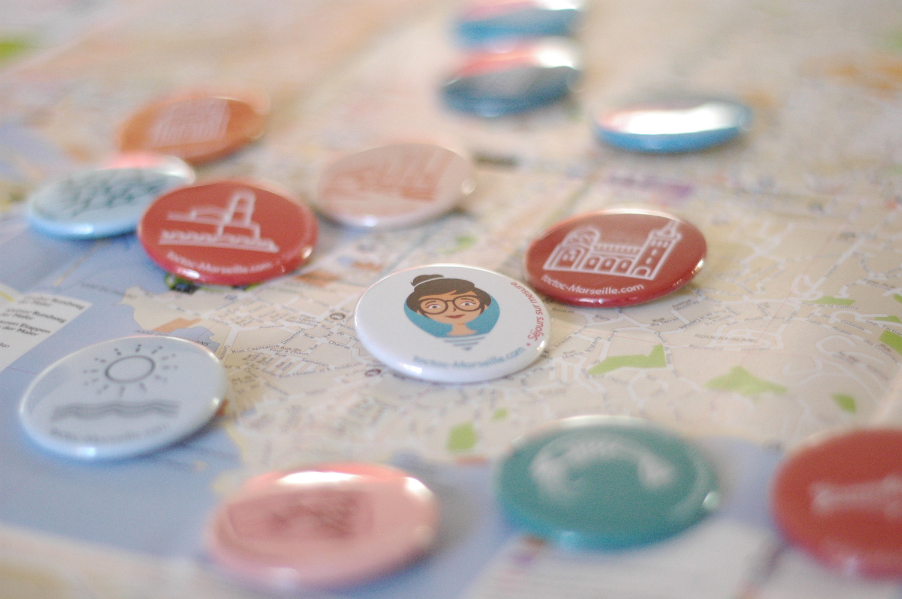
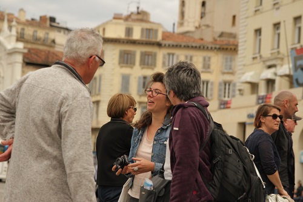

# Comment ça marche ?

<figure class="timeline-row" markdown="1">

<figcaption class="timeline-row__info" markdown="1">
## Contactez-moi ! {.fa .fa-mobile .color-blue1}
Dans un premier temps, contactez-moi par email ou par téléphone. Vous pouvez m'indiquer les dates, la durée de votre séjour et le nombre de personnes qui vous accompagne.  
[toctocMarseille@gmail.com](mailto:toctocMarseille@gmail.com)
</figcaption>
</figure>

<figure class="timeline-row" markdown="1">

<figcaption class="timeline-row__info" markdown="1">
## Parlez-moi de vous {.fa .fa-user .color-green1}
Après reception de votre demande, nous pourrons discuter (par email, téléphone ou skype) de votre séjour, vos envies, vos goûts, vos attentes, votre budget. Je pourrais alors vous faire mes premières suggestions et vous proposer des idées d'activités et d'itinéraires.
</figcaption>
</figure>

<figure class="timeline-row" markdown="1">

<figcaption class="timeline-row__info" markdown="1">
## Réservez {.fa .fa-ticket .color-orange1}
Lorsque vous serez satisfait par mes propositions de programme et visites personalisés, vous payez un acompte de 30% pour confirmer votre réservation.
</figcaption>
</figure>

<figure class="timeline-row" markdown="1">

<figcaption class="timeline-row__info" markdown="1">
## Profitez de votre séjour à Marseille ! {.fa .fa-camera-retro .color-red3}
A votre arrivée à Marseille, je vous accueille personnellement et vous réglez les 70% restants.
</figcaption>
</figure>